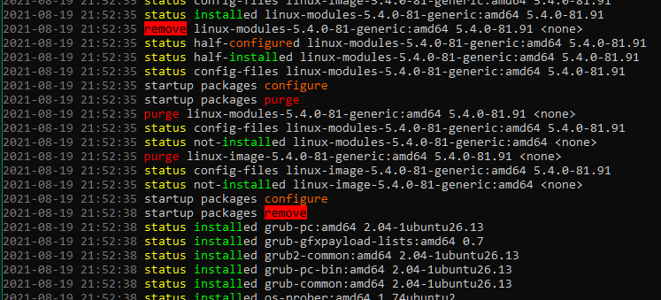
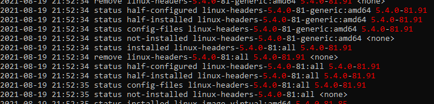
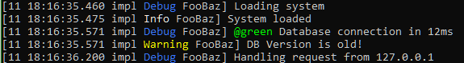

# Stream Coloring Script

Reads text from stdin and outputs it with coloring and other formatting.

This tool is intended primarily to help one quickly scan and understand log files. For example, we can look at the dpkg log with some relevant or interesting words colored:

	cat /var/log/dpkg.log | scolor -jw purge install status configure -c redbgblack remove | less -R

Or maybe have it highlight things that look like a version number:

	cat /var/log/dpkg.log | scolor "\d+(\.\d+)+" | less -R

Watch a log in realtime, with a bit of sprucing up:

	tail -f some.log | scolor -ae

# Install

- Have Python 3 installed.
- Dump `scolor` somewhere in your PATH.
- `chmod +x scolor`

